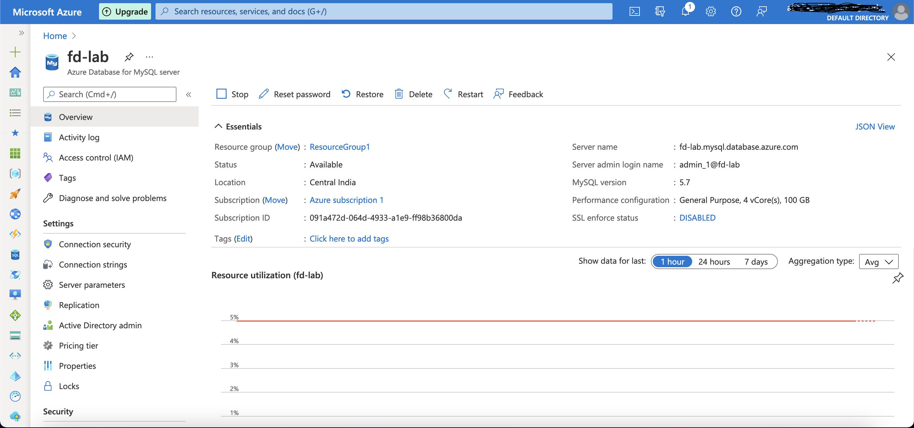

# Report for the Education Today project take home task

## Objectives:
<br/>

There were primarily 2 tasks/ workflows which needed to be implemented: 
1. Author Citations:  
    - Given  an AuthorId we need to find the papers most commonly cited in the given authors' work.
2. Co-Author Affiliations:
    - Given a institution ID/ Affiliation ID we need to find all the associated co-authors who have worked with authors from the given institute
    - In this set of co-authors we further need to find which are the most common Affiliations/ Institutes these co-authors belong to.

## Data Given:
<br/>

A zip file containing 5 text files was provided. Each file in this .zip represents a single table in the greater [Academic Graph schema](https://docs.microsoft.com/en-us/academic-services/graph/reference-data-schema#affiliations). 

### Description of Tables used for the given objectives:
1. **Authors**: This file contained author specific information
2. **Affiliations**: This file has information about the institution or affiliation
3. **Papers**:  This file contains inforamtion about the papers which are published
4. **PaperAuthorAffiliations**: This is an intermediate table which relates the papers, authors and affiliations
5. **PaperReferences**: This table contains information of papers referenced by every paper

# Methodology
<br/>

## Data Processing and Parsing:
<br/>


I started with the data parsing and preprocessing stage as the first step. During this stage the .txt file was verified and found to contain tab seperated values. Each line in the .txt files indicated a single row in the table.

For parsing the data, I used pandas's library in python which exposed specific methods to import csv/ tsv data. This library worked well for most of the input .txt files but in case of PaperAuthorAffiliations and  Papers the library gave a dataframe with wrong number of rows.

On further analysis I found that this was because of how escape characters were treated by the library. To solve this issue, I created seperate parser functions:
```
Parser.parsePaperAuthorAffiliations(self, tableFileChunkName) 
```

```
Parser.parsePapers(self, tableFileChunkName)
```

Using these and other methods in the ```Parser``` class I was able to correctly parse and convert the data into respective types as mentioned in the [schema](https://docs.microsoft.com/en-us/academic-services/graph/reference-data-schema#affiliations).


<br/>

## Creating a MySQL server using Azure:
<br/>


For storing the parsed data I went ahead with the creation of an Azure hosted MySQL server. I went with a basic single server instance with 4 operational CPU cores and deployed it into a closer region.

Reference:  https://docs.microsoft.com/en-us/azure/mysql/quickstart-create-mysql-server-database-using-azure-portal




<br/>

## Migrating data to MySQL DB:
<br/>


After parsing the data and creating the DB, I started migrating the data to the DB. Before transfering the actual data to the DB, I created a database name ```educationtoday``` and also created all the five table schemas (```Authors```, ```Affiliations```, ```Papers```, ```PaperAuthorAffiliations```, ```PaperReferences```)

Post this, I utilized the Data class function:
```
Data.storeTableData(self, tableDataFrame, tableName)
```
to store the previously parsed dataframes into the DB. For storing this data, I established a connection using ```sqlalchemy``` to the MySQL DB and used ```pandas``` to push the data.


Additionally, during storing the data for Papers table I faced some connection termination's because of the size. To solve this issue, I split the Papers.txt file into 5 smaller chunks using 
```util.splitFile()```

**NOTE**: I have experimented with join queries for the given tasks but found that because of multiple joins between large tables many tables the operations were slow. This is the reason I went with multiple queries which also made the code simpler.

<br/>

## BackEnd:
<br/>


Once the data was stored in the DB, I developed a data service ```data.py``` which exposed a Data class. This class provides methods for specific DB related operations.

After the Data Layer, I created 2 API's in ```app.py```  which call the Data service for the necessary information and pass it on as a API response.

```
topReferencedPapers()
topAffliatedInstitutions()
```

Cross Origin access was provided so that my React application will be able to call these API's. For CORS ```flask-cors``` library was used.


<br/>

## FrontEnd:
<br/>


For the frontend, I used ```create-react-app``` to make a sample React project. Following this, I added Router configuration in ```src/App.js``` file. 

Three main pages were created for this application:
1. Home/ Landing page: This is the first page that user lands on and provides links to the two workflows
2. MostCited:  This is the page for the first task realted to Author's citations
3. MostAffiliated: This is the page related to the third task related to collaborating institutes.

Components were created which call and display the results of ```/mostcited``` and ```/mostaffiliated``` API's

```
src\components\MostAffiliatedResults.js
src\components\MostCitedResults.js
```

Once the user submits the respective form in MostCited or MostAffiliated pages, this information is passed on to the above components which call the API's and render the response.
